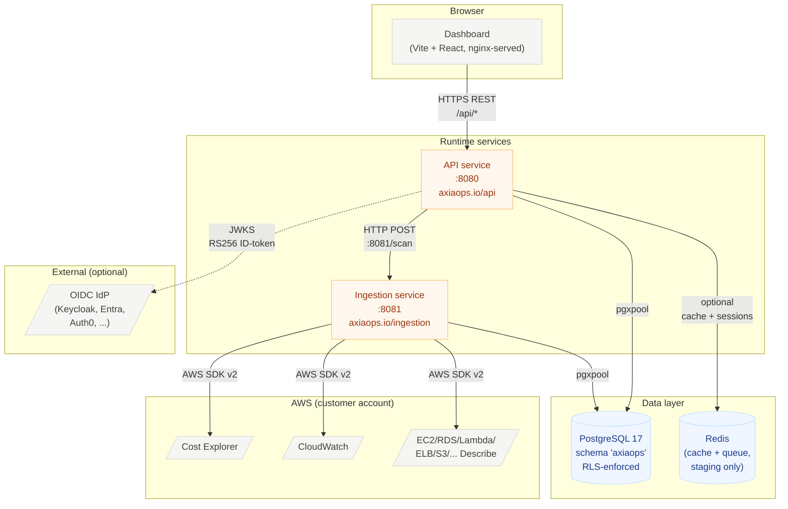
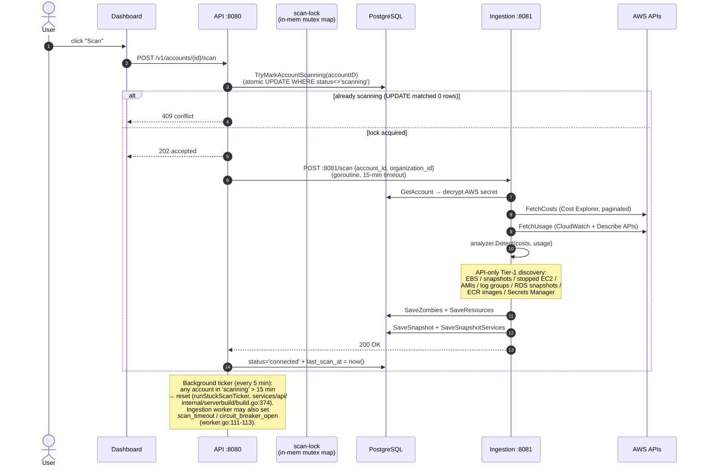
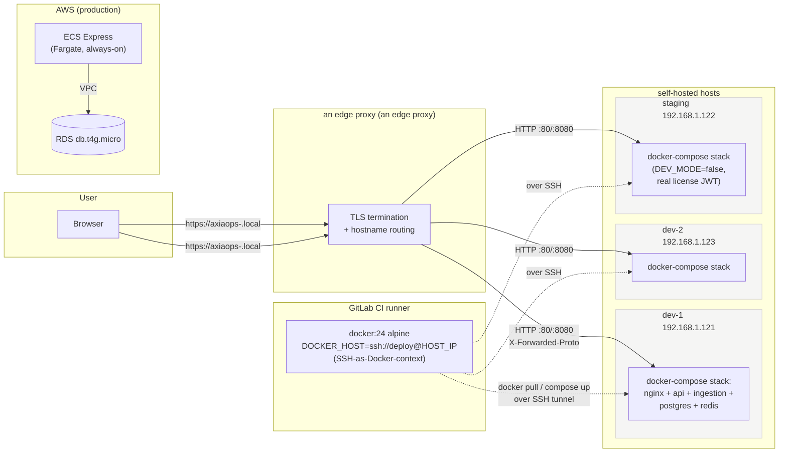
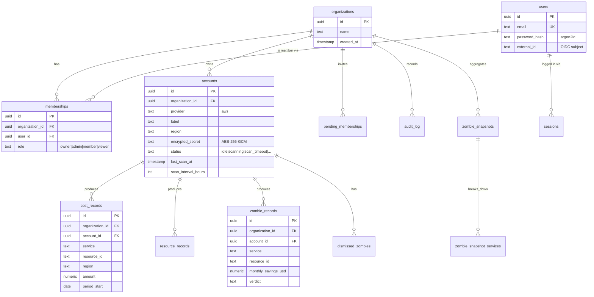
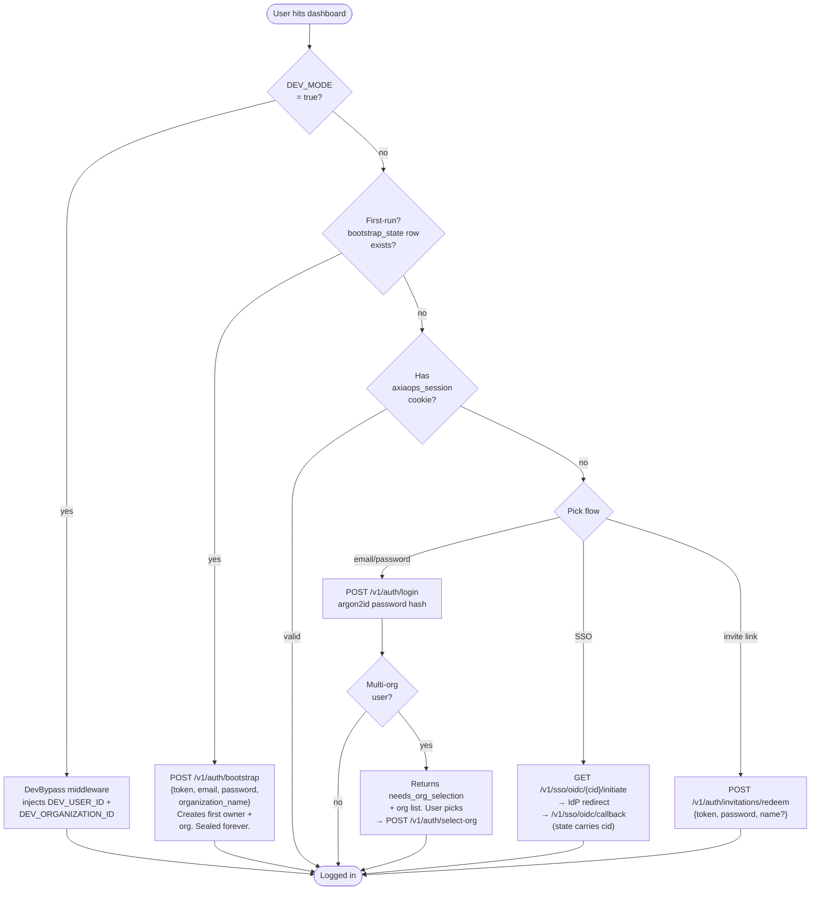
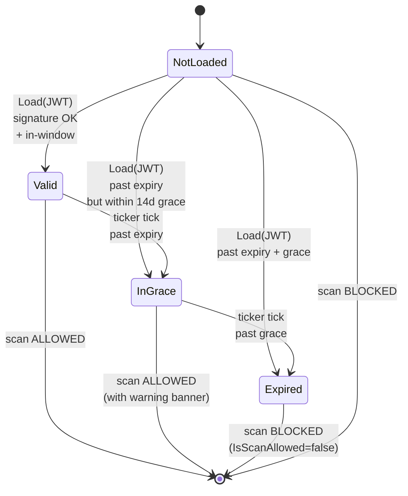
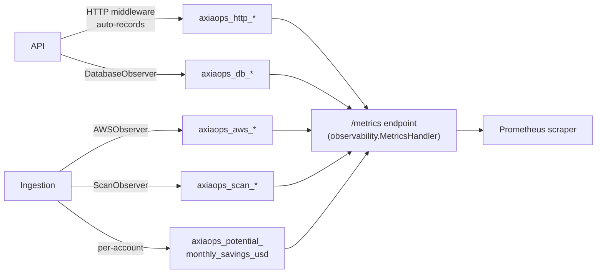
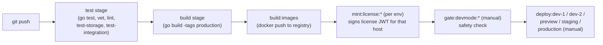

# AxiaOps — Architecture Reference

This is the navigable hub for engineers working on AxiaOps. Read this first, then drill into the linked CLAUDE.md and per-feature docs only when you need detail.

> **Companion docs**
> - [DEVELOPER_GUIDE.md](DEVELOPER_GUIDE.md) — onboarding, env setup, common workflows
> - [/CLAUDE.md](../CLAUDE.md) — project-level conventions, commands, dev workflow
> - Per-service: [api/CLAUDE.md](../services/api/CLAUDE.md), [ingestion/CLAUDE.md](../services/ingestion/CLAUDE.md), [shared/CLAUDE.md](../services/shared/CLAUDE.md) — dashboard has no per-service CLAUDE.md yet, see [DEVELOPER_GUIDE.md § 3](DEVELOPER_GUIDE.md#3-code-conventions-youll-want-to-absorb) for dashboard conventions
> - Auth: [auth.md](auth.md), [auth_flow.md](auth_flow.md), [native-auth-bootstrap.md](native-auth-bootstrap.md)
> - Deployment: [deployment.md](deployment.md), [ci.md](ci.md)
> - Detection: [aws-coverage.md](aws-coverage.md), [tier2_detections_status.md](tier2_detections_status.md), [cloudtrail-analysis.md](cloudtrail-analysis.md)
> - Roadmap plans: [CUR_EXTENSION_PLAN.md](CUR_EXTENSION_PLAN.md) — adding AWS Cost & Usage Reports as a parallel data source to Cost Explorer

## TL;DR

AxiaOps is a FinOps SaaS that detects idle/zombie cloud resources still incurring cost. The MVP targets AWS; multi-cloud is on the Phase 4 roadmap. Three Go services communicate via HTTP — `api` (`:8080`) reads from PostgreSQL and exposes a REST surface to a Vite/React dashboard; `ingestion` (`:8081`) fetches AWS data and writes to PostgreSQL; `shared` is a library, not a process. Multi-tenancy is enforced at the database level via Postgres Row-Level Security keyed on `app.organization_id`. Self-hosted licenses gate scan execution; DEV_MODE bypasses auth and uses an embedded license fixture.

---

## 1. System Overview



**Module layout** (Go workspace via `go.work`):

| Module | Path | Type | Imports |
|---|---|---|---|
| `axiaops.io/api` | `services/api/` | Binary | `axiaops.io/shared` |
| `axiaops.io/ingestion` | `services/ingestion/` | Binary | `axiaops.io/shared`, AWS SDK v2 |
| `axiaops.io/shared` | `services/shared/` | Library | (none of the others) |
| `dashboard-v2` | `services/dashboard/` | Vite + React app | — |
| migrate tool | `services/migrate/` | Binary | `axiaops.io/shared` |

The `shared` module is the boundary between "domain logic that runs anywhere" and "service-specific concerns". AWS SDK is *not* in `shared` — cloud-provider code lives in `ingestion/internal/provider/`.

---

## 2. Service Responsibilities

### `api` — read path + control plane

REST server on `:8080`. Exposes the dashboard's full surface (zombies, summary, trends, costs, accounts CRUD, dismissals, audit log, memberships, invitations, native auth, SSO ceremony, license/version metadata, observability metrics). Reads from PostgreSQL, never calls AWS directly. Triggers scans by HTTP POST to ingestion. See [api/CLAUDE.md](../services/api/CLAUDE.md) for the full endpoint table.

Notable patterns:
- Go 1.22+ `mux.HandleFunc("METHOD /path", fn)` route registration
- **Per-account scan lock is enforced at the DB row level**, not in-memory: `TryMarkAccountScanning` in `services/shared/storage/postgres/postgres.go` runs `UPDATE accounts SET status='scanning' WHERE id=$1 AND status<>'scanning'` and returns whether the row was updated. The atomicity of the UPDATE prevents duplicate concurrent scans even across multiple API replicas.
- 5-minute background ticker (`runStuckScanTicker` wired by `serverbuild.StartTickers` in `services/api/internal/serverbuild/build.go`) resets accounts stuck in `scanning` >15 min via `ResetStuckScans` in `services/shared/storage/postgres/migrate.go`. The 15-min const (`stuckScanTimeout`) lives in `services/api/cmd/main.go`.
- `production` build tag strips DEV_MODE from customer-shipping binaries

### `ingestion` — write path + AWS work

Long-lived HTTP server on `:8081`. Receives `POST /scan` with `{account_id, organization_id}`, decrypts the per-account AWS secret, calls Cost Explorer + CloudWatch + Describe APIs, runs detection, writes results. Mirrored `production` build-tag treatment so DEV_MODE can't be re-enabled at the ingestion side either.

### `shared` — domain library

Domain models, the `Store` interface (single contract for all data access), PostgreSQL implementation with RLS, the analyzer (pure detection functions), AES-256-GCM crypto, structured logging via `log/slog`, Prometheus observability helpers, cache + queue abstractions, license verification, audit-log helpers. See [shared/CLAUDE.md](../services/shared/CLAUDE.md).

### `dashboard` — Vite + React (web)

Served as a static bundle. In `start-dev` Vite proxies `/api/*` to the API on 8080; in `start-staging` nginx serves the bundle and proxies through the same path to the dockerised API. **Not** React Native or Expo — the codebase is pure web.

---

## 3. Scan Lifecycle (end-to-end)

The single most important data-flow path in the system.



**Backend account statuses** (canonical values written through the `Store`):

| Status | Set by | Meaning |
|---|---|---|
| `connected` | scan-success path | Healthy; last scan succeeded |
| `scanning` | `TryMarkAccountScanning` | Scan in progress; prevents concurrent re-entry |
| `error` | scan failure path | Last scan returned an error |
| `scan_timeout` | ingestion worker (`services/ingestion/cmd/worker.go:113`) | Scheduled scan exceeded its watchdog window |
| `circuit_breaker_open` | ingestion worker (`services/ingestion/cmd/worker.go:111`) | Repeated failures tripped the per-account breaker — scheduler skips this account until reset |

The dashboard renders the last two with the `theme.warning` (yellow) callout in `services/dashboard/src/components/AccountSelector.jsx` and `screens/AccountSettingsScreen.jsx`.

---

## 4. Deployment Topology

The deployment shape is non-obvious — easy to misread from `.gitlab-ci.yml`. Each deployed env runs on its **own** self-hosted host (not a shared Docker host), with **an edge proxy (an edge proxy)** as the edge TLS terminator.



**Footguns that have bitten before**:

- `DEPLOY_SSH_PRIVATE_KEY` must be a **File-type** GitLab CI variable. Variable-type strips PEM newlines and silently corrupts the key.
- The CI runner uses raw IPs because the Alpine `docker:24` image's musl libc has no mDNS resolution — humans use `axiaops-<env>.local`, CI can't.
- `PUBLIC_HOST` per env should be the externally-reachable an edge proxy hostname (`https://axiaops-<env>.local`), not host IP+port. Empty → SSO ceremonies fail at the IdP redirect.
- `INTERNAL_DNS` per env is needed for self-hosted IdP setups with split-horizon DNS — without it the API tries to resolve the IdP via public DNS, hits whatever WAF fronts it (Cloudflare Bot Fight Mode rejects Go's default UA on `/.well-known/openid-configuration`), and OIDC discovery fails.
- All `deploy:*` jobs are **manual gates** — never auto-triggered. If one is running, an operator clicked it.

---

## 5. Database & Multi-Tenancy

PostgreSQL 17 with **schema `axiaops`** (not `public`). Two connection roles: `axiaops_owner` runs migrations and owns DDL; `axiaops` is the app role bound by RLS policies.

### Row-Level Security pattern

Every per-organization table carries `organization_id UUID NOT NULL` and a policy of the form:

```sql
CREATE POLICY tenant_isolation ON {table}
  USING (organization_id = current_setting('app.organization_id', true));
```

The application sets `app.organization_id` **per transaction** (not per pool checkout) via `set_config('app.organization_id', $1, true)` with `local=true` scope. See `services/shared/storage/postgres/postgres.go:74` (`setOrganization`). Every Store method opens a tx, calls `setOrganization` first, then runs queries.

Code surface: `storage.WithOrganizationID(ctx, organizationID)` puts the org on the context; the postgres Store reads it on every query.

**Fail-closed guard for forgotten WithOrganizationID** — `services/shared/storage/postgres/postgres.go:87` explicitly checks the context-org-id before issuing any query and returns `"postgres: organization_id missing from context"` if absent. So a handler that forgets to call `WithOrganizationID()` gets a hard error at the DB boundary rather than a silent empty result set. (RLS would also filter to empty if the GUC were unset — the guard is the *first* line of defence; RLS is the second.)

### Schema overview



(Truncated — see `services/shared/storage/postgres/migrations/` for the canonical, versioned schema.)

### Migration system

Versioned SQL files, run on service startup using `MIGRATION_DATABASE_URL` (owner role). Naming: `NNN_description.up.sql` / `NNN_description.down.sql`. As of 2026-05, the migration count is in the high 050s — see [docs/migrations.md](migrations.md) for the workflow when adding one.

`postgres.Migrate` is a wrapper, not a thin call to golang-migrate. On every boot it:

1. Pins a `*sql.Conn` and acquires a wrapper-level session advisory lock (`AxiaOpsM`).
2. Runs **orphan recovery** — finalises any `axiaops.migration_history` row whose post-step UPDATE was lost to a crash (per the §Failure modes truth table in `docs/migration-history-table-design.md`).
3. Runs **backfill** if `migration_history` is empty but `migration_state` is non-empty (first deploy).
4. Runs **drift detection** — compares the on-disk SHA-256 of every embedded `.up.sql` against the recorded SHA. Mismatch → `slog.Warn` (log-only; `Migrate` runs in short-lived migrate / axiaopsctl binaries that have no `/metrics` endpoint, so a Prometheus counter would be unobservable). `MIGRATION_HISTORY_STRICT=true` flips to refuse-to-start.
5. Drives `m.Steps(1)` in a loop. Each step gets a pre-INSERT 'started' row (committed before the DDL) and a post-step UPDATE to `succeeded`/`failed`.

`migration_state` is still owned by golang-migrate as before. `migration_history` layers on top — every event (up / down / force) lands a forensic row keyed by `id BIGSERIAL`. Operators inspect via `bin/axiaopsctl migrate history` or directly from `axiaops.migration_history`. DML on the table is owner-only; the app user has `SELECT` only.

---

## 6. Authentication & Authorization

There are **four** active login paths plus a development bypass:



### Middleware composition (outermost → innermost)

`services/api/internal/serverbuild/build.go:285-340` (`ComposeServer`):

1. **CORS** (line 340) — outermost; reflects allowlisted origins, emits `Access-Control-Allow-Credentials: true` for non-`*` configs.
2. **Request-ID + structured logging + Prometheus metrics** (line 310) — every request gets a request_id; HTTP histograms recorded automatically.
3. **Auth** — branches on DEV_MODE:
   - `DevBypass` (line 299, definition `middleware/auth.go:129`) injects `DEV_USER_ID` / `DEV_ORGANIZATION_ID` / `DEV_USER_EMAIL` onto the request context without a DB lookup.
   - **OR** `WrapNative + EnforceSSO` (lines 304–305) — cookie session lookup against the `sessions` table, role + org resolved via `MembershipLookup`. SSO enforcement applies on top per-org.
4. **Rate limit** (line 292) — login endpoints share a single budget so an attacker can't double the cap by alternating `/auth/login` and `/auth/select-org`.
5. **HTTP mux / handlers** (innermost).

**Public paths** (no auth required) are listed in `middleware/auth.go:45-60` (`publicPath`): `/health`, `/livez`, `/readyz`, `/metrics`, every `/v1/auth/*`, `/v1/sso/discover`, and the OIDC initiate/callback paths.

### Notes

- **Native auth**: argon2id hashes, constant-time compared at `services/api/internal/auth/password.go:104` (`Verify`). Sessions in the `sessions` table; cookie name `axiaops_session`; lookup at `auth/session.go:185` (`Manager.ValidateSession`) which checks the cache first then falls through to the DB.
- **Multi-membership** (B1.5) takes a two-step path: `/v1/auth/login` returns `needs_org_selection`, frontend collects choice, posts to `/v1/auth/select-org` which **re-validates the password** (defence in depth — never trust the frontend to remember step 1). 401 `invalid_credentials` collapses wrong-password / unknown-email / org-not-in-set into one shape so the no-creds membership-probe channel narrows.
- **OIDC SSO**: per-connection JWKS, RS256 ID-token validation. State carries the connection ID per Tasks.md 2.7.22; the legacy path-cid callback `/v1/sso/oidc/{cid}/callback` stays wired one release as a deprecation window. Session minting at `services/api/internal/sso/oidc_callback.go:317` with `auth_mode='sso'`.
- **Sessions cap**: `SESSIONS_PER_USER_CAP` (default 10). The (cap+1)th login revokes the oldest.
- **In-app org switcher** (B1.5): `/v1/auth/switch-org` revokes the current session, mints a fresh one bound to the target org, audits the switch as `session.org_switched`.
- `DEV_MODE` is bypassed by the `production` build tag — see § 7.

See [auth.md](auth.md) and [auth_flow.md](auth_flow.md) for deeper detail.

### Right-to-erasure paths

- `DELETE /v1/users/me` — hard-delete the caller. 409 if sole owner of any organization. Audit log anonymised across all orgs.
- `DELETE /v1/organizations/me` — cascade-delete the entire org including audit log. Owner-only.

---

## 7. License Verification (B1.6 + B1.7)

The self-hosted distribution gates scan execution behind a license JWT. Both binaries call `license.VerifyAtBoot` at startup and run `license.RunTicker`; both consult `license.IsScanAllowed` at every scan-gate.

**Call sites** (verified):
- `VerifyAtBoot`: API at `services/api/cmd/main.go:62`, ingestion at `services/ingestion/cmd/main.go:110`
- `IsScanAllowed` (via `IsScanAllowedForState`): API handler at `services/api/internal/api/handler.go:1004`, ingestion handler at `services/ingestion/cmd/main.go:157`, ingestion background worker at `services/ingestion/cmd/worker.go:55`



Build-tag split (`services/shared/license/embed_{dev,production}.go`):

- **`embed_dev.go`** (default builds) — `devEmbeddedPubKeyPEM` and `devFixtureJWT` are populated. The dev RS256 public key + a 100-year fixture JWT signed by the matching dev keypair are bundled. DEV_MODE Loads this fixture so dev exercises the full Load → CheckExpiry → state chain (state=Valid, customer_id="axiaops-dev-fixture").
- **`embed_production.go`** (`-tags production`) — both `devEmbeddedPubKeyPEM` and `devFixtureJWT` are nil. The production binary literally has no dev pubkey to verify the fixture against, so even a planted dev JWT can't load. Only a real production-signed JWT works.

`IsScanAllowed` returns true only when state ∈ {Valid, InGrace}. `IsEnforcementBypassed()` is a seam reserved for the future SaaS composition root — no production self-hosted path sets it post-layer-4.

See [b1.6-amendment-feature-gating.md](b1.6-amendment-feature-gating.md).

---

## 8. Detection Engine

Two tiers depending on the data source:

| Tier | Signal | Examples |
|---|---|---|
| **Tier 1** | API-only — state derived from Describe calls, no CloudWatch | Unattached EBS volumes, orphaned snapshots, long-stopped EC2, unused AMIs, retention=null log groups, untagged ECR images, never-accessed Secrets |
| **Tier 2** | CloudWatch metric below threshold | Idle EC2 (CPUUtilization ≤ 5%), abandoned RDS (DatabaseConnections = 0), unused Lambda (Invocations = 0), idle ELB, unused NAT GW, etc. |

Detection lives in `services/shared/analyzer/`:

1. `Detect(costs, usage)` in `detector.go:46` — indexes usage by `resource_id` (O(1)), iterates cost records, looks up the service's rule, compares usage against the threshold, and emits a zombie record if the threshold is met.
2. `Summarize(zombies)` aggregates total monthly savings + per-service breakdown.
3. `AnnotateAll(costs, usage, zombies)` marks each cost record as zombie or active.

The `serviceRules` map lives in `analyzer/rules.go:17` — each entry is `rule{metric string, threshold float64, unit string, reason string}`. Adding a new Tier-2 service is one row in this map plus a CloudWatch metric mapping in ingestion.

**Strict validation at the boundary** — `model.CostRecord.Validate()` and `analyzer.UsageRecord.Validate()` reject unknown services, malformed currencies, bad regions, negative amounts. Production scan paths log-and-skip; tests fail-fast. The motivation: a loose validator silently drops "wrong-spelling EC2" rows and `Detect()` returns "0 zombies" with no signal.

**Golden-file detection tests** under `services/shared/analyzer/testdata/golden/<scenario>/` — each folder is a sub-test driven by `analyzer/golden_test.go`. Add a rule case → add a folder; rule change → `UPDATE_GOLDEN=1 go test ./analyzer/...` to rewrite the expected files in place, then review the diff before committing.

### Adding a new detection rule

1. `services/shared/analyzer/rules.go` — add to the `serviceRules` map
2. **Tier 2** (CloudWatch-driven): add the metric fetch in `services/ingestion/internal/provider/aws/cloudwatch.go` so it populates a `UsageRecord` for that resource
3. **Tier 1** (API-only): add a `DiscoverXxxZombies()` function in `services/ingestion/internal/provider/aws/discover_*.go` and call it from `runIngestionCore()` in `services/ingestion/cmd/main.go` (the orchestrator loop, around the existing Discover* calls between lines 544–685)
4. `services/shared/analyzer/testdata/golden/<scenario>/` — add the golden fixtures (input_costs.json, input_usage.json, expected_zombies.json)
5. Unit test for the threshold in `services/shared/analyzer/`
6. Update IAM policy in `docs/production.md`

See [aws-coverage.md](aws-coverage.md) and the [detection-rule skill](../.claude/skills/detection-rule/) (auto-loaded when adding detection support).

---

## 9. Observability

Phase 2.6 added Prometheus + structured logging across the stack. See [OBSERVABILITY.md](OBSERVABILITY.md) for the full guide.



**Use `observability.MetricsHandler()`** to expose the endpoint, **not** `promhttp.Handler()`. The helper merges the package-private registry that holds `Global.*` with `prometheus.DefaultGatherer`. Wiring `promhttp.Handler()` directly only scrapes the default registry — every metric in `observability/` silently vanishes. (Caught on MR !85; the helper is now the single seam.)

Logs go through `slog` configured by `logging.Init(service)`. JSON in production (`LOG_OUTPUT=json`), text in dev. Auto-attaches `service`, `env`, `version`, `commit_sha`.

---

## 10. CI/CD

GitLab pipeline. Stages defined in `.gitlab-ci.yml`. Per [ci.md](ci.md) and [gitlab_ci_pipeline.md](gitlab_ci_pipeline.md).



Two specifics worth knowing:

- **Production-build smoke test** — `make build-production` runs `go build -tags production` on every pipeline. If a new feature reads `os.Getenv("DEV_MODE")` directly instead of going through `cmd/devmode_*.go`, the regression-pin tests in `cmd/devmode_{dev,production}_test.go` catch it in <30s.
- **`gate:devmode:<env>` jobs** are the layer-1 safety gate. Manual click required before deploy.

---

## 11. Security Posture

- **Secrets at rest** — AWS account secrets are AES-256-GCM encrypted with `ENCRYPTION_KEY` (32-byte hex) before DB storage. Never commit `.env` or credentials.
- **Multi-tenancy** — RLS-enforced at the DB level. Application bug ≠ tenant data leak (the DB refuses to return out-of-tenant rows).
- **Production IAM** — use roles, not access keys. Customer-onboarding cross-account-role flow documented in [cross-account-roles-design.md](cross-account-roles-design.md).
- **Build-tag hardening** — `production` build tag strips DEV_MODE from customer binaries. The lint job `test:lint:no-direct-devmode` rejects any new `os.Getenv("DEV_MODE")` reads outside `cmd/devmode_*.go`.
- **Native auth** — argon2id password hashes; cookie sessions; per-connection OIDC JWKS for SSO; rate limits on login + select-org sharing one budget so an attacker can't double the cap.
- **Audit log** — every privileged mutation writes a row via the `audit` helper in `services/api/internal/audit/`. Right-to-erasure paths anonymise audit_log instead of dropping it.

See `docs/compliance/` and `docs/decisions/` for governance decisions.

---

## 12. Where to find things

| Looking for... | Start at |
|---|---|
| API endpoint registration | `services/api/internal/api/handler.go` (Register method) |
| Auth middleware composition | `services/api/internal/middleware/auth.go` + `auth_native.go` |
| Native session minting | `services/api/internal/auth/` (NativeProvider, SessionManager) |
| OIDC ceremony | `services/api/internal/sso/` (initiate + callback) |
| Scan trigger from API | `services/api/internal/api/handler.go` → `scanAccount` handler + scan-lock map |
| AWS Cost Explorer client | `services/ingestion/internal/provider/aws/costs.go` |
| AWS CloudWatch client | `services/ingestion/internal/provider/aws/cloudwatch.go` |
| Per-service Describe calls | `services/ingestion/internal/provider/aws/discover_*.go` |
| Detection rules table | `services/shared/analyzer/detector.go` (`serviceRules`) |
| Domain types | `services/shared/model/` |
| Store interface | `services/shared/storage/storage.go` |
| Postgres impl | `services/shared/storage/postgres/postgres.go` |
| Migrations | `services/shared/storage/postgres/migrations/` |
| License lib | `services/shared/license/` |
| Observability helpers | `services/shared/observability/` |
| Theme tokens (dashboard) | `services/dashboard/src/theme/ThemeContext.jsx` |
| Dashboard route shell | `services/dashboard/src/components/AppShell.jsx` |
| Dashboard API client | `services/dashboard/src/api/client.js` |

---

## 13. Glossary

| Term | Meaning |
|---|---|
| **Tier 1 / Tier 2** | Detection method — Tier 1 is API-only; Tier 2 needs CloudWatch metrics. |
| **Zombie / Idle resource** | A cloud resource that's billing but unused per the threshold table in CLAUDE.md. |
| **Scan** | The full pipeline: fetch costs + usage, run detection, persist results, snapshot. |
| **Snapshot** | A dated aggregate row in `zombie_snapshots` written at scan-end; powers the trend chart. |
| **RLS** | Postgres Row-Level Security; the multi-tenancy enforcement mechanism. |
| **DEV_MODE** | Auth-bypass + dev-fixture-license env. Used by `make start-dev` and the `deploy:dev-*` jobs. Stripped from `-tags production` binaries. |
| **start-dev** | `make start-dev` — host-mode Go services + Postgres container. |
| **start-staging** | `make start-staging` — full docker-compose stack with native auth on (DEV_MODE=false). |
| **an edge proxy** | an edge proxy — edge TLS terminator in front of every deployed env. |
| **Mummer** | The AWS-API mock used in integration tests; fixtures under `test-infra/mummer/`. |
| **Bootstrap** | The first-run install flow — single-use token mints the first owner + organization. Sealed forever after first success. |
