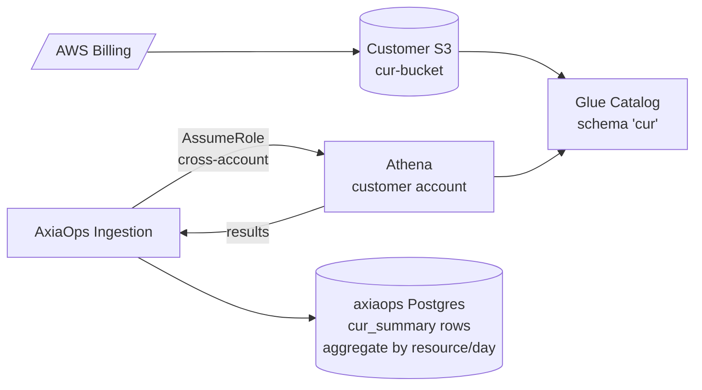

# Extending AxiaOps to Ingest AWS CUR

A concrete plan to add **Cost and Usage Report (CUR)** as a parallel data source alongside the existing Cost Explorer (CE) integration. CUR is what most competitors (Vantage, CloudZero, Apptio/Kubecost, Finout, nOps) use as their primary cost feed, and the gap matters for resource-level attribution, RI/SP allocation, and per-tag analytics.

> **Status:** Plan only. No code changes in this commit. Targets Phase 4+ on the roadmap.

---

## 1. Why CUR (and why not just keep CE)

### What we have today (Cost Explorer-based)

- Path: `provider.FetchCosts` → `costexplorer.GetCostAndUsage` → daily granularity, grouped by SERVICE+REGION → `model.CostRecord` rows. See `services/ingestion/internal/provider/aws/aws.go:322`.
- Pluggable per-provider behind `provider.Provider` (`services/ingestion/internal/provider/provider.go:14`). Already provider-agnostic at the seam.
- `FetchResourceCosts` patches in resource-level cost for a hand-curated set of services (`resourceLevelServices` allowlist at `aws.go:397`) when CE returns it — works for EC2, RDS, Lambda, but not all services.
- Tag data: only available via CE's `GetCostAndUsage` `GroupBy` dimension; one tag key per call; not joined to resources.

### What CUR adds (the competitive lever)

| Dimension | Cost Explorer (today) | CUR (what we're adding) |
|---|---|---|
| **Granularity** | Daily max | **Hourly** (and finer for some line items) |
| **Resource attribution** | Spotty — only for ~6 service families when grouped by RESOURCE_ID | **Every line item** carries `lineItem/ResourceId` |
| **Tags** | One tag key per query, expensive | **All user + AWS-generated tags** on every row |
| **RI / Savings Plan** | High-level coverage view | **Line-item amortisation** — exact RI coverage gap, SP commitment vs actual usage per resource per hour |
| **Cost categories** | Limited | **Every category** — data transfer, storage class, NAT egress, inter-AZ, etc. |
| **API cost to us** | $0.01 / GetCostAndUsage call | **$0** — CUR is delivered to S3 by AWS for free |
| **API rate limits** | Yes — CE throttles at scale | **None** — files in S3 |
| **Backfill** | ~14 months max | **As far back as the customer enabled CUR delivery** |

### Why competitors use CUR

- **Vantage / CloudZero / Finout** all need hourly granularity for things they sell on: idle-window detection, rightsizing recommendations, anomaly alerting at sub-day resolution. CE can't do those well.
- **RI/SP optimisation** — the *biggest* FinOps savings lever for medium-sized customers. Without line-item RI amortisation you can't tell a customer "your RI X is 60% utilised, downsize it" or "this resource would benefit from SP coverage". Pure CE can't generate either recommendation accurately.
- **Cost-allocation by tag** — the FinOps standard reporting unit. CE is essentially unusable for "show me all costs tagged `team=platform` per account per month" at scale; CUR makes it a single Athena query.
- **API rate ceilings** — CE has account-level rate limits (1 GetCostAndUsage per second, dropping to fractions per second under load). At 1000+ customer accounts polling daily, CE becomes a bottleneck *and* a recurring bill (~$30–100/mo per active customer just in CE charges). CUR removes both.

CE doesn't go away — it stays as the default source for customers who haven't set up CUR yet, and as a cross-check for amortised totals. CUR is **additive**.

---

## 2. Two implementation patterns

Pick one (or sequence them).

### Pattern A — Athena-on-customer-bucket (recommended Phase 4 start)

Customer enables CUR delivery to **their own** S3 bucket and grants AxiaOps cross-account read access via the existing role-based auth flow (`AuthMethod=role` already in `model.Account`). Athena queries CUR via Glue Catalog directly in the customer's S3.



**Pros:**
- AxiaOps stores no raw CUR — only daily/hourly aggregates we use for detection and reporting (~10MB / customer / month).
- Fastest to ship: leverages existing cross-account role flow, no new IAM lift on AxiaOps side.
- Customer pays Athena scan cost (~$5/TB, typically <$1/account/month for daily aggregations).

**Cons:**
- Athena query latency is 10–60 seconds per scan; we must aggregate, not ad-hoc-query.
- Requires the customer to have or enable Athena in their account (most do).
- We can't run cross-account analytics without a separate replication stage.

### Pattern B — Replicate-to-AxiaOps + own warehouse

Customer's CUR is replicated (S3 cross-region replication or AxiaOps-pulled) to an AxiaOps-owned S3 bucket and queried via AxiaOps's own Athena/Trino/ClickHouse cluster.

**Pros:**
- AxiaOps controls query latency and cost.
- Cross-customer analytics (anonymised benchmarks) become possible.
- No customer-side Athena dependency.

**Cons:**
- Significant infra investment: S3 bucket (with KMS), Glue or own catalog, Athena workspace + query budgets, IAM lift for replication.
- AxiaOps pays the storage bill (cents per customer per month, but adds up).
- Compliance burden: we now hold raw billing data that's customer-confidential.

**Recommendation:** Ship Pattern A first. Move to B only when (a) customer count makes per-account Athena queries operationally painful, or (b) a benchmark/anonymised-comparison feature requires it.

The plan below assumes **Pattern A**.

---

## 3. Concrete implementation plan (Pattern A)

### 3.1 New domain types in `services/shared/model/`

#### `model/cur_setting.go` (new)
A per-account CUR configuration record. Lives next to `Account` because it's account-scoped (one CUR per AWS account, possibly one per organization in payer-account setups).

```go
type CURSetting struct {
    ID                string    `json:"id"`
    OrganizationID    string    `json:"organization_id"`
    AccountID         string    `json:"account_id"`           // FK to accounts.id
    BucketName        string    `json:"bucket_name"`          // s3 bucket holding the CUR
    BucketRegion      string    `json:"bucket_region"`
    ReportPath        string    `json:"report_path"`          // prefix in the bucket, e.g. "cur/v1/"
    ReportName        string    `json:"report_name"`          // CUR report-name
    AthenaWorkgroup   string    `json:"athena_workgroup"`     // workgroup to run queries in
    AthenaDatabase    string    `json:"athena_database"`      // glue db name
    AthenaTable       string    `json:"athena_table"`         // glue table name
    Format            string    `json:"format"`               // "csv-gz" | "parquet" (CUR 1) | "cur2-parquet" (CUR 2.0)
    Status            string    `json:"status"`               // "verified" | "pending_setup" | "error"
    LastFetchedAt     *time.Time `json:"last_fetched_at"`
    LastErrorMessage  string    `json:"last_error_message,omitempty"`
    CreatedAt         time.Time `json:"created_at"`
}
```

#### `model/cur_line.go` (new) — used only inside ingestion, not persisted

A normalised CUR row used by the analyzer. We don't store these long-term; they roll up into `CostRecord`s + `CURSummary` records for fast reads.

```go
type CURLine struct {
    AccountID            string
    UsageStartUTC        time.Time   // hourly
    UsageEndUTC          time.Time
    Service              string      // already-normalised internal name
    ProductRegion        string
    ResourceID           string      // ARN, may be empty for top-level rows
    LineItemType         string      // Usage | DiscountedUsage | SavingsPlanCoveredUsage | RIFee | …
    UsageType            string      // BoxUsage:t3.medium, DataTransfer-Out-Bytes, …
    UnblendedCost        float64
    NetUnblendedCost     float64     // after discounts/credits
    AmortizedCost        float64
    NetAmortizedCost     float64
    RICoverage           float64     // 0..1
    SPCoverage           float64     // 0..1
    Tags                 map[string]string
}
```

#### Extend `model/cost.go`

Optional fields on the existing `CostRecord` so CE-derived rows and CUR-derived rows can co-exist:

```go
type CostRecord struct {
    // ... existing fields ...
    Source        string  `json:"source"`                  // "ce" | "cur"
    Granularity   string  `json:"granularity"`             // "hourly" | "daily" | "monthly"
    LineItemType  string  `json:"line_item_type,omitempty"` // CUR-only
    AmortizedAmount *float64 `json:"amortized_amount,omitempty"` // CUR-only; CE doesn't expose this cleanly per resource
}
```

`CostRecord.Validate()` (`model/cost.go:65`) gets two more checks: `Source ∈ {"ce", "cur"}` and `Granularity ∈ {"hourly", "daily", "monthly"}`.

### 3.2 New ingestion package — `services/ingestion/internal/provider/aws/cur/`

| File | Responsibility |
|---|---|
| `cur.go` | Main entry point — `FetchCURCosts(ctx, setting, start, end) → []model.CostRecord, error`. Composes the steps below. |
| `athena.go` | Athena client wrapper. `RunQuery(workgroup, sql) → resultLocation, error` + `FetchResults(location) → rows, error`. Polls with backoff (Athena queries are async). |
| `query.go` | SQL templates: a daily-aggregate query for the CE-equivalent rollup, an hourly-resource-level query for detection-driven scans, an RI/SP-coverage query. |
| `manifest.go` | Manifest-JSON parser for CUR 1 (each delivery has a manifest listing the data files and column schema). For CUR 2.0 (parquet via Glue) the manifest is replaced by the Glue table — handled by branching on `setting.Format`. |
| `cur_test.go` | Unit tests with mock Athena client. Mirror the existing `mockCEClient` pattern in `aws_test.go`. |

`cur.FetchCURCosts` returns `[]model.CostRecord` so it slots straight into the existing aggregation in `cmd/main.go:445`. Internally it queries Athena, paginates results, and projects each row to a `CostRecord` with `Source="cur"` and the higher granularity preserved.

### 3.3 Provider seam extension

Two options:

**Option A — extend `Provider` interface:**
```go
type Provider interface {
    Name() string
    FetchCosts(ctx, start, end) ([]model.CostRecord, error)
    FetchCURCosts(ctx, start, end) ([]model.CostRecord, error)  // new; may return nil if not configured
}
```

**Option B — keep `Provider` minimal, add a parallel interface:**
```go
type CURProvider interface {
    FetchCURCosts(ctx, start, end) ([]model.CostRecord, error)
}
```

Then in `cmd/main.go:436`:
```go
for _, p := range providers {
    records, _ := p.FetchCosts(ctx, start, end)
    if cur, ok := p.(CURProvider); ok {
        curRecords, _ := cur.FetchCURCosts(ctx, start, end)
        records = append(records, curRecords...)
    }
    // ... existing save path ...
}
```

**Pick B.** Future cloud adapters (GCP BigQuery export, Azure Cost Export) implement *their* equivalent of CUR via a similar parallel interface. Keeps `Provider` lean.

### 3.4 New Postgres tables

#### Migration `025_cur_settings.up.sql`
```sql
CREATE TABLE axiaops.cur_settings (
    id UUID PRIMARY KEY DEFAULT gen_random_uuid(),
    organization_id UUID NOT NULL REFERENCES axiaops.organizations(id) ON DELETE CASCADE,
    account_id UUID NOT NULL REFERENCES axiaops.accounts(id) ON DELETE CASCADE,
    bucket_name TEXT NOT NULL,
    bucket_region TEXT NOT NULL,
    report_path TEXT NOT NULL,
    report_name TEXT NOT NULL,
    athena_workgroup TEXT NOT NULL,
    athena_database TEXT NOT NULL,
    athena_table TEXT NOT NULL,
    format TEXT NOT NULL CHECK (format IN ('csv-gz', 'parquet', 'cur2-parquet')),
    status TEXT NOT NULL CHECK (status IN ('verified', 'pending_setup', 'error')),
    last_fetched_at TIMESTAMPTZ,
    last_error_message TEXT,
    created_at TIMESTAMPTZ NOT NULL DEFAULT now(),
    UNIQUE (account_id)
);

ALTER TABLE axiaops.cur_settings ENABLE ROW LEVEL SECURITY;
CREATE POLICY tenant_isolation ON axiaops.cur_settings
  USING (organization_id = current_setting('app.organization_id', true));
```

#### Migration `026_cost_records_cur_columns.up.sql`
Adds the new optional columns to `cost_records`:
```sql
ALTER TABLE axiaops.cost_records
    ADD COLUMN source TEXT NOT NULL DEFAULT 'ce' CHECK (source IN ('ce', 'cur')),
    ADD COLUMN granularity TEXT NOT NULL DEFAULT 'daily' CHECK (granularity IN ('hourly', 'daily', 'monthly')),
    ADD COLUMN line_item_type TEXT,
    ADD COLUMN amortized_amount NUMERIC(20, 6);

CREATE INDEX cost_records_source_idx ON axiaops.cost_records(source);
CREATE INDEX cost_records_resource_period_idx
    ON axiaops.cost_records(account_id, resource_id, period_start)
    WHERE source = 'cur';
```

The partial index keeps the existing CE query plans untouched while making the CUR resource-level lookups fast.

#### Optional migration `027_cur_summary.up.sql`
A pre-aggregated daily roll-up if hourly volume becomes painful at scale. Skip in v1.

### 3.5 Store interface additions

In `services/shared/storage/storage.go`:
```go
SaveCURSetting(ctx context.Context, s model.CURSetting) error
GetCURSetting(ctx context.Context, accountID string) (*model.CURSetting, error)
DeleteCURSetting(ctx context.Context, id string) error
ListCURSettings(ctx context.Context) ([]model.CURSetting, error)
```

Implementation in `postgres/postgres.go` follows the existing `SaveAccount` / `GetAccount` shape (begin tx → setOrganization → query → commit).

### 3.6 New API endpoints

In `services/api/internal/api/handler.go` (`Register` method):

| Method | Path | Auth tier | Purpose |
|---|---|---|---|
| GET | `/v1/accounts/{id}/cur` | role:`accounts:read` | Return the configured CUR setting for an account, or 404. |
| POST | `/v1/accounts/{id}/cur` | role:`accounts:write` | Create / update CUR setting. Triggers a verification scan (lists S3 manifest, runs a probe Athena query). |
| POST | `/v1/accounts/{id}/cur/verify` | role:`accounts:write` | Re-run verification without rewriting the row. |
| DELETE | `/v1/accounts/{id}/cur` | role:`accounts:write` | Disable CUR ingestion (reverts to CE-only). |
| GET | `/v1/cur/setup-instructions` | authed | Return a one-page customer-facing guide for enabling CUR + granting cross-account read. Static-ish content; lets the dashboard show clear steps. |

The verification handler is the important one — it confirms (a) we can list the bucket, (b) the manifest parses, (c) Athena answers a probe query. Sets `status = 'verified'` on success. On failure, stores `last_error_message` so the dashboard can show "Step 3 failed: bucket policy missing s3:GetObject" instead of a generic toast.

### 3.7 Dashboard changes

| Screen | Change |
|---|---|
| **`pages/CloudAccounts.jsx`** | Add a "CUR connected" / "CUR not configured" badge per account row. Click-through to setup. |
| **New `screens/CURSetupScreen.jsx`** | 4-step wizard: (1) "Enable CUR delivery" — instructions + AWS Console deeplinks, (2) "Grant access" — one-click IAM policy snippet, (3) "Verify" — calls `/v1/accounts/{id}/cur/verify`, shows pass/fail per check, (4) "Backfill" — optional — kick off a one-off historical scan. |
| **`screens/DashboardScreen.jsx`** | Add an info chip on the savings card: "Source: CUR (hourly)" or "Source: CE (daily)" so it's obvious which feed is driving numbers. |
| **`screens/CostAnalyticsScreen.jsx`** | Three new tabs unlocked when CUR is verified: "RI Coverage", "Savings Plan Utilization", "Per-Tag Costs". Each is a CUR-only Athena query summarised into a table. |

Per `services/dashboard/CLAUDE.md` conventions — wizard uses `useTheme()`, calls go through `api/client.js`.

### 3.8 IAM model — what the customer grants

The existing role-based auth flow (`AuthMethod=role` in `model.Account`) gives AxiaOps an IAM role in the customer's account. CUR adds these permissions to that role:

```json
{
  "Statement": [
    {
      "Effect": "Allow",
      "Action": ["s3:GetObject", "s3:ListBucket"],
      "Resource": [
        "arn:aws:s3:::CUSTOMER-CUR-BUCKET",
        "arn:aws:s3:::CUSTOMER-CUR-BUCKET/*"
      ]
    },
    {
      "Effect": "Allow",
      "Action": [
        "athena:StartQueryExecution",
        "athena:GetQueryExecution",
        "athena:GetQueryResults",
        "athena:StopQueryExecution"
      ],
      "Resource": "arn:aws:athena:*:*:workgroup/axiaops*"
    },
    {
      "Effect": "Allow",
      "Action": [
        "glue:GetDatabase", "glue:GetTable", "glue:GetPartitions"
      ],
      "Resource": [
        "arn:aws:glue:*:*:catalog",
        "arn:aws:glue:*:*:database/CUR_DB",
        "arn:aws:glue:*:*:table/CUR_DB/*"
      ]
    }
  ]
}
```

This goes into [docs/cross-account-roles-design.md](cross-account-roles-design.md) as a CUR addendum, and the [docs/production.md](production.md) IAM appendix gets the Athena/Glue permissions added.

### 3.9 Detection engine integration

Largely unchanged. CUR-derived `CostRecord`s flow into the same `analyzer.Detect()` (`detector.go:46`). Two improvements that become possible:

1. **Hourly idle windows** — currently we say "EC2 with avg CPU ≤ 5%" over the full lookback window. With hourly CUR + hourly CloudWatch data, we can say "EC2 idle for 168 contiguous hours" — much stronger signal, fewer false positives. New rule field in `analyzer/rules.go`: `requiresHourly bool`.
2. **RI/SP-aware zombie verdicts** — a t3.medium instance covered by an RI is "free at the margin" — killing it doesn't save money until the RI expires. Detection should suppress or downgrade such verdicts. New zombie-record field `EffectiveSavingsUSD` (vs `MonthlySavingsUSD`) — derived from `LineItemType=DiscountedUsage` rows in CUR. Dashboard shows the *effective* savings as the primary number; the gross savings stays as a tooltip.

### 3.10 Observability additions

In `services/shared/observability/`:

```go
// New metrics
axiaops_cur_query_duration_seconds   { workgroup, query_type }    // histogram
axiaops_cur_query_errors_total       { workgroup, error_type }    // counter
axiaops_cur_rows_fetched_total       { account_id }               // counter
axiaops_cur_athena_scan_bytes_total  { account_id }               // counter — track the cost of our own queries
axiaops_cur_settings_count           { status }                    // gauge — verified/pending/error
```

`axiaops_cur_athena_scan_bytes_total` is critical — it's how we know we're not silently ratcheting up the customer's Athena bill. Alert at >1 TB/account/month.

### 3.11 Testing strategy

| Layer | Approach |
|---|---|
| **Unit** | Mock Athena client in `cur_test.go` returning canned result rows. Cover pagination, query-failure, empty-result, schema-mismatch. |
| **Golden** | Add `analyzer/testdata/golden/cur_*` scenarios: CUR-derived hourly costs + usage → expected zombies. Same harness, no infra needed. |
| **Integration** | Use Mummer (or a new S3 + Athena mock under `test-infra/cur-mock/`) to spin up a docker-compose local-Athena substitute. Probably **MinIO + Trino** in compose — Trino can read parquet and supports the CUR schema. CI job `test:integration:cur`. |
| **Manual / staging** | Real CUR delivered to a dev-account S3 bucket. Wire `axiaops-internal-staging` against it for end-to-end smoke testing. |

The existing CE integration tests (`fake_integration_test.go`) stay green — CUR is additive.

### 3.12 Documentation updates

- `docs/aws-coverage.md` — add a CUR-vs-CE comparison column.
- `docs/cross-account-roles-design.md` — append the CUR-required IAM block.
- `docs/production.md` — Athena workgroup setup, query-cost monitoring guidance.
- `docs/cur-setup-customer-guide.md` (new) — the externally-shareable PDF source for "how to enable CUR for AxiaOps".
- `docs/ARCHITECTURE.md` § 1 system diagram — add S3 + Athena to the AWS subsystem; § 8 detection engine — note hourly path.
- `services/ingestion/CLAUDE.md` — endpoint + provider table updates.

---

## 4. Open design questions (decide before coding)

1. **CUR 1 vs CUR 2.0?** AWS released CUR 2.0 (parquet-only, schema-versioned, delivered via Data Exports) in 2024. New customers default to it; existing customers may have CUR 1. **Recommendation:** support both. Branch on `setting.Format` in the manifest parser. CUR 2.0 is simpler (parquet + Glue table out of the box); CUR 1 needs the gzipped-CSV + manifest path.

2. **Where does the Glue table live?** The customer's account, set up by them, or AxiaOps creates it via CloudFormation as part of the verify step? **Recommendation:** customer creates it (lower IAM lift on their side, pattern customers expect). We document the exact SQL in the setup wizard.

3. **What's the "CUR-or-CE" decision rule?** Per-account toggle, or auto-detect-and-prefer-CUR? **Recommendation:** auto-detect — if `cur_settings.status='verified'`, use CUR for that account on the next scan; fall back to CE on Athena failure. Per-account toggle in advanced settings for ops escape hatch.

4. **Backfill window?** How far back do we run a one-off historical scan when a customer enables CUR? **Recommendation:** 90 days by default, capped at 13 months (CUR delivery max). Surface as a slider in the wizard's Step 4.

5. **Cross-account-payer consolidation.** A single CUR can cover multiple AWS accounts (in an AWS Organization). Today AxiaOps assumes one IAM access per account. **Recommendation:** introduce a "payer-account" concept — one `cur_settings` row may serve multiple `accounts.id`s. Adds a join column. Worth doing properly from day one rather than retrofitting.

6. **Storage strategy for hourly data.** Hourly granularity at scale means 24× more `cost_records` rows. At 1000 customer accounts × 10K resources × 24 hours × 30 days = 7.2B rows/month. Postgres will struggle. **Recommendation:** v1 stores CUR records at *daily* granularity (one row per service+resource+day, same as CE) — Athena does the hourly-to-daily aggregation in-query. Add an hourly path **only** when a feature explicitly needs sub-day resolution (e.g., the "spot instance idle window" detector). This keeps `cost_records` storage flat.

7. **License gating.** Is CUR a paid-tier feature? **Recommendation:** yes — CUR-driven RI/SP analytics is a clear Premium/Enterprise differentiator. Gate via `license.IsFeatureEnabled("cur")` (new helper). DEV_MODE fixture license has it on; production licenses have it on per the customer's tier.

---

## 5. Effort estimate

Engineer-weeks, assuming one engineer plus a half-time reviewer.

| Workstream | Estimate |
|---|---|
| Schema + Store + new model types | 0.5 wk |
| Provider extension (CUR Athena client + query templates + manifest parser) | 1.5 wk |
| API endpoints + verification flow | 0.5 wk |
| Dashboard wizard + CUR-aware screens | 1.5 wk |
| Detection engine — hourly + RI/SP awareness | 1 wk |
| Observability + Athena cost guards | 0.25 wk |
| Documentation + customer-facing setup guide | 0.5 wk |
| Tests (unit + golden + integration) | 1.25 wk |
| **Total (lean v1)** | **~7 weeks** |

Pattern B (own warehouse) adds another ~6–8 weeks for the storage/replication infrastructure if pursued later.

---

## 6. Suggested rollout

1. **Week 0–1:** schema + Store + CUR settings CRUD endpoints + dashboard "CUR not configured" badge. No actual CUR data yet — just the connection plumbing. Ship behind a feature flag.
2. **Week 2–3:** Athena client + CUR query templates + the verification flow. Run the new path against a staging customer's CUR. Compare CUR-derived totals vs CE — they should match within ±1% (CUR is the truth, CE is rounded). This is the integration-confidence step.
3. **Week 4–5:** dashboard wizard, hourly-aware detection rules, RI/SP coverage tab. Ship to dev-1.
4. **Week 6:** documentation, customer-facing setup guide, observability dashboards, license gating wired up.
5. **Week 7:** soak in staging with real CUR, then release behind a per-customer flag for a small beta.

Each step ships independently. If any step turns up a deal-breaker, the previous step's work isn't wasted — we still have the connection plumbing for a future re-attempt.
