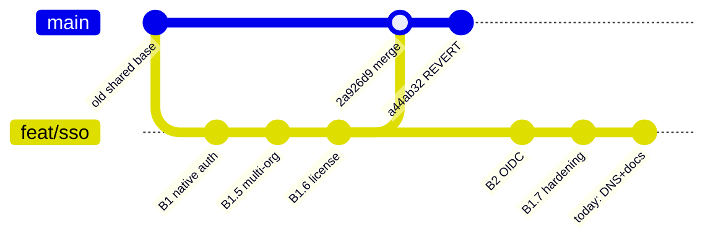

# Merging feat/sso → develop

A visual walkthrough of the **revert-of-a-merge** problem on `feat/sso` and
the textbook fix. Written for this specific MR (`!85`) but the pattern
generalises.

---

## TL;DR

```
develop has   merge(feat/sso) → revert(merge)   in its history.

Merging feat/sso → develop today, naively, will SILENTLY DROP
all the original B1 / B1.5 / B1.6 work.

Fix: run  git revert -m 1 a44ab32  on feat/sso first.
Then merge normally.
```

---

## 1. The setup — where we are today



ASCII version of the same picture:

```
                                            (2 commits ahead)
develop:  ──...── 4d0e590 ── 2a926d9 ── a44ab32
                              │            │
                       merge of         REVERT
                       feat/sso         of merge

feat/sso: ──...── 4d0e590 ── (69 commits) ──→ 0e7adc2 (HEAD)
                                                  │
                                          today's session ends here
```

Two commits develop has that feat/sso doesn't:

| SHA       | Subject |
|-----------|---------|
| `2a926d9` | `Merge branch 'feat/sso' into develop` |
| `a44ab32` | `Revert "Merge branch 'feat/sso' into develop"` |

Net effect on develop's working tree: roughly back to where it started
before the merge (because the revert undid the merge's diff).

But Git's **history graph** still records that the merge happened.
That's the trap.

---

## 2. The trap — why naive merge silently drops work

When you run `git merge feat/sso` on develop, Git computes a 3-way diff
using the **merge-base** as the common ancestor:

```
                            merge-base
                                ↓
                            4d0e590
                            (a commit INSIDE feat/sso —
                             the one the merge brought in)
                            
                       /                    \
                      /                      \
            develop's tree                feat/sso's tree
            (post-revert state =          (HEAD =
             pre-feat/sso work)            post-feat/sso-work +
                                           69 more commits)
```

What Git sees in this 3-way:

| Side | State |
|---|---|
| **Base** (`4d0e590`) | Has B1 / B1.5 / B1.6 changes |
| **Develop** (HEAD) | Does NOT have them (revert took them out) |
| **feat/sso** (HEAD) | Has them + 69 more commits on top |

Git's 3-way merge logic concludes:

> "Develop **deleted** these changes. feat/sso **kept** them.
>  When two sides diverge from base, side that changed wins.
>  Develop changed (deleted). feat/sso didn't change (kept).
>  → Honour develop's intent: don't add these changes back."

The result:

```
naive  git merge feat/sso  on develop
     ↓
✓ pipeline goes green
✓ the 69 NEW commits' changes apply where they don't conflict
✗ all original B1 / B1.5 / B1.6 work is GONE from develop
```

This is the documented failure mode in
[Git's "How to revert a faulty merge" how-to](https://git-scm.com/docs/howto/revert-a-faulty-merge).

---

## 3. The fix — revert the revert

Add ONE commit on feat/sso whose diff is the inverse of `a44ab32`'s diff.
Concretely:

```bash
git checkout feat/sso
git revert -m 1 a44ab32
git push origin feat/sso
```

Resulting graph:

```
develop:  ──...── 4d0e590 ── 2a926d9 ── a44ab32     (unchanged)

feat/sso: ──...── 4d0e590 ── (69 commits) ── 0e7adc2 ── REVERT_REVERT
                                                            │
                                                  new commit whose diff
                                                  re-establishes the
                                                  B1/B1.5/B1.6 work
```

Now the 3-way diff Git computes for `git merge feat/sso` on develop:

| Side | State |
|---|---|
| **Base** (`4d0e590`) | Has B1 / B1.5 / B1.6 changes |
| **Develop** (HEAD) | Does NOT have them |
| **feat/sso** (HEAD = REVERT_REVERT) | Has them — actively re-applied by REVERT_REVERT |

Git's logic now:

> "Develop **changed** (deleted these).
>  feat/sso **changed** (re-added these via REVERT_REVERT).
>  Both sides changed — combine the intents.
>  feat/sso's intent wins for these files (it's actively re-applying).
>  → Add the changes back to develop."

Result:

```
✓ pipeline goes green
✓ the 69 NEW commits apply
✓ the original B1 / B1.5 / B1.6 work IS PRESENT on develop
✓ no silent loss
```

Linus Torvalds' phrase for this:

> *"The reverse of a revert is a revert."*

---

## 4. Verifying before push

After the `git revert -m 1 a44ab32`, before pushing:

### Check 1 — diff of the new commit

```bash
git diff HEAD~1 HEAD --stat | head -30
```

Expected: a long list of files in `services/api/internal/auth/`,
`services/api/internal/sso/`, `services/shared/license/`, etc. — basically
the inverse of `a44ab32`'s file list.

### Check 2 — conflicts vs develop

```bash
git merge-tree \
  $(git merge-base feat/sso origin/develop) \
  feat/sso \
  origin/develop \
| grep -c '<<<<<<<'
```

Expected: drop from **32** (today's count) to **0 or a small number**.
Any remaining conflicts are real divergence — not the revert-revert ghost.

### Check 3 — file list intersection

```bash
git diff --name-only origin/develop...feat/sso > /tmp/feat-sso-files.txt
wc -l /tmp/feat-sso-files.txt
```

Expected: ~150-200 files (the full feat/sso surface area).

---

## 5. Comparison with the alternatives

```
┌──────────────────────────┬─────────────┬─────────────┬───────────────────┐
│ Strategy                 │ Preserves   │ Force-push  │ MR threads survive│
│                          │ commit SHAs │ required?   │ ?                 │
├──────────────────────────┼─────────────┼─────────────┼───────────────────┤
│ ✅ Revert-the-revert     │ Yes         │ No          │ Yes               │
│    (recommended)         │             │             │                   │
├──────────────────────────┼─────────────┼─────────────┼───────────────────┤
│    Rebase feat/sso       │ No (rewrites│ Yes         │ Anchored to old   │
│    onto develop          │ all 69)     │             │ SHAs → break      │
├──────────────────────────┼─────────────┼─────────────┼───────────────────┤
│    Squash-merge MR       │ No (collapses│ No         │ Yes (the MR is    │
│    !85                   │ to 1 commit)│             │ kept; just the    │
│                          │             │             │ commit history    │
│                          │             │             │ inside collapses) │
└──────────────────────────┴─────────────┴─────────────┴───────────────────┘
```

For MR `!85`'s shape (69 commits with substantive per-commit rationale,
architect-review trails, code-review fix follow-ups), **revert-the-revert
wins** — minimal disruption, preserves history, plays well with the
existing MR thread.

---

## 6. The full sequence, when ready

```
┌───────────────────────────────────────────────────────────┐
│                                                           │
│  STEP 1                                                   │
│  ────────                                                 │
│  git fetch origin develop                                 │
│                                                           │
│  STEP 2                                                   │
│  ────────                                                 │
│  git checkout feat/sso                                    │
│  git revert -m 1 a44ab32                                  │
│      → opens editor for commit message; default is fine   │
│      → resulting commit's diff = inverse of a44ab32's diff│
│                                                           │
│  STEP 3 — verify before push                              │
│  ──────────────────────────                               │
│  git diff HEAD~1 HEAD --stat | head -30                   │
│    (sanity-check the file list)                           │
│  git merge-tree $(git merge-base feat/sso origin/develop) │
│    feat/sso origin/develop | grep -c '<<<<<<<'            │
│    (conflict count should be near 0)                      │
│                                                           │
│  STEP 4                                                   │
│  ────────                                                 │
│  git push origin feat/sso                                 │
│      → MR !85 picks up the new commit automatically       │
│                                                           │
│  STEP 5 — when reviewer is happy                          │
│  ────────────────────────────                             │
│  Merge MR !85 → develop normally                          │
│      → naive merge is now SAFE because of REVERT_REVERT   │
│                                                           │
└───────────────────────────────────────────────────────────┘
```

---

## 7. Why this happened in the first place

(Postmortem-flavoured, for the eventual retro.)

Develop's `2a926d9 merge → a44ab32 revert` pattern usually means one of:

- A premature merge that turned out to break something post-merge → reverted
  to stop the bleed → original branch (feat/sso) kept evolving toward a
  proper landing
- An accidental merge that wasn't ready → reverted to undo

Either way, the operationally safe move would have been to **revert the
revert immediately** on feat/sso (creating `REVERT_REVERT` then) so the
branch was always in a "ready to re-merge cleanly" state. Doing it now,
post-69-commits, works equally well — but the longer the delay, the
larger the diff in the REVERT_REVERT commit, and the scarier it looks at
review time.

Future-prevention: when reverting a merge, decide immediately whether
the original branch is dead (delete it) or coming back (revert-the-revert
on the branch right then). Don't leave it dangling.

---

## 8. Visual recap

```
NAIVE MERGE (DON'T DO THIS):

  feat/sso ────────────────►  merge develop  ──►  ❌ B1/B1.5/B1.6 GONE
                                  ↑
                          merge-base inside feat/sso
                          → Git "honours" develop's revert
                          → silent data loss


SAFE MERGE (DO THIS):

  feat/sso ──→ revert-the-revert ──►  merge develop  ──►  ✅ all work present
                       ↑
              new commit re-applies
              the diff develop had reverted
              → Git sees feat/sso actively re-adding
              → merge picks up the changes
```

---

## References

- [Git: How to revert a faulty merge](https://git-scm.com/docs/howto/revert-a-faulty-merge)
  — the canonical doc; this guide is essentially a visual restatement of
  its argument with this MR's specifics filled in
- This repo's commits:
  - `2a926d9` — the original merge on develop
  - `a44ab32` — the revert that created today's situation
  - `0e7adc2` — current `feat/sso` HEAD (as of this writing)
