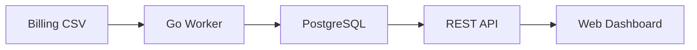

# Developer Tools — Free

## IDEs & Editors

| Tool | Language Support | Free |
|------|-----------------|------|
| **GoLand** (JetBrains) | Go — best in class | 30-day trial; free for open-source projects |
| **VS Code** | Everything | Fully free |
| **Cursor** | Everything + AI | Free tier (200 uses/month) |
| **Zed** | Everything | Fully free, very fast |

**Recommendation:** Use **GoLand** for backend Go development (you already have JetBrains tools based on the `.idea` folder). Use **VS Code** or **Cursor** for the frontend.

Apply for a **JetBrains Open Source license** if you open-source the detection engine — gives you all JetBrains IDEs free.

---

## API Development & Testing

| Tool | What It Does | Free |
|------|-------------|------|
| **Bruno** | API client (like Postman, open-source) | Fully free, no account needed |
| **Hoppscotch** | Web-based API client | Fully free |
| **httpie** | Terminal HTTP client | Fully free |
| **Swagger UI** | Auto-generate API docs from OpenAPI spec | Fully free |

**Recommendation:** **Bruno** — stores API collections as plain files in your repo (no proprietary format, version-controlled). Much better than Postman for a solo developer.

---

## Local Development

| Tool | What It Does | Free |
|------|-------------|------|
| **Docker Desktop** | Run containers locally | Free for personal use |
| **OrbStack** | Faster Docker alternative on Mac | Free for personal use |
| **Colima** | Open-source Docker runtime for Mac | Fully free |
| **TablePlus** | Database GUI (PostgreSQL, SQLite) | Free tier (2 tabs, 2 connections) |
| **DBeaver** | Database GUI | Fully free, open-source |

**Recommendation:** Replace Docker Desktop with **OrbStack** — significantly faster on Apple Silicon, lower memory usage, free for personal use.

---

## Secrets Management (Local)

| Tool | What It Does | Free |
|------|-------------|------|
| **direnv** | Auto-loads `.env` when you `cd` into a directory | Fully free |
| **1Password CLI** | Inject secrets from 1Password vault into shell | Requires 1Password subscription |
| **Doppler** | Centralised secrets management | Free for 1 project |

**Recommendation:** **direnv** + `.env` files (gitignored) for local development. **Doppler** free tier for syncing secrets across environments when you add a second machine or collaborator.

---

## Code Documentation

| Tool | What It Does | Free |
|------|-------------|------|
| **pkgsite** (go doc) | Auto-generate Go package docs | Built into Go toolchain |
| **Swagger / OpenAPI** | REST API documentation | Free tooling (swaggo/swag for Go) |
| **Docusaurus** | Static documentation site | Fully free, open-source |
| **GitLab Wiki** | Per-repo wiki | Included in GitLab free tier |

**Recommendation:** Use **swaggo/swag** to auto-generate OpenAPI docs from Go code comments. Host on GitLab Pages (free) when you need a public API reference.

---

## Diagramming

| Tool | What It Does | Free |
|------|-------------|------|
| **Excalidraw** | Whiteboard / architecture sketches | Fully free, open-source |
| **draw.io (diagrams.net)** | Professional diagrams | Fully free |
| **Mermaid** | Diagrams as code (rendered in GitLab MDs) | Fully free, built into GitLab |

**Recommendation:** Use **Mermaid** inside GitLab markdown files for architecture diagrams — they render natively in GitLab and are version-controlled with the code.

