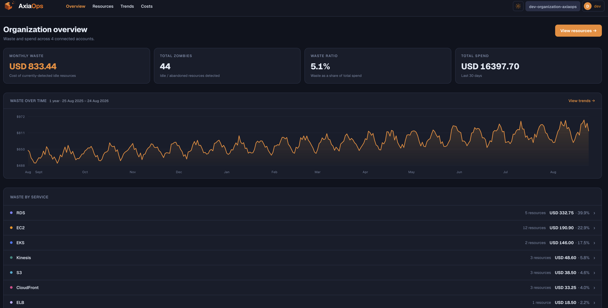
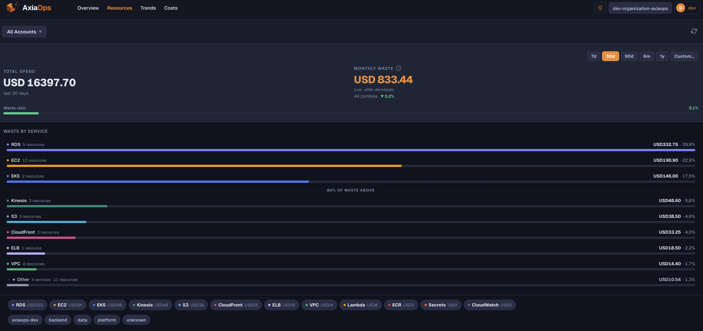
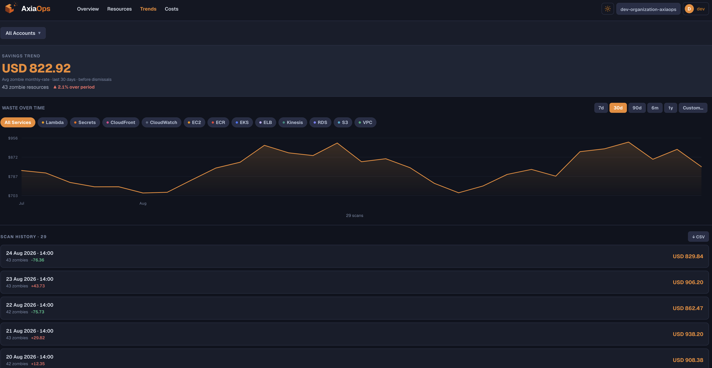
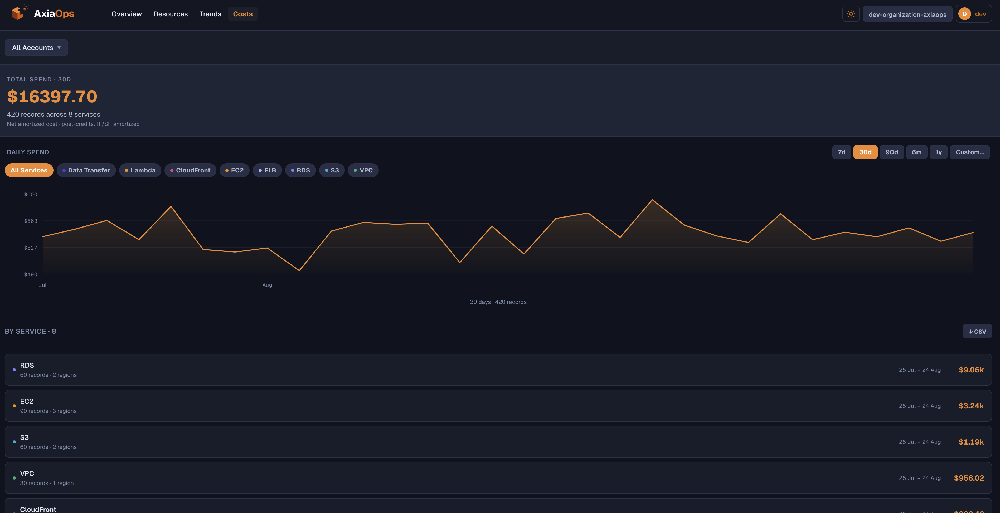

import { Card, CardGrid } from '@astrojs/starlight/components';

## What AxiaOps does

AxiaOps connects to an AWS account (via a scoped cross-account IAM role — no
long-lived access keys) and scans it for **zombie resources**: things that
are still running, still billing, and doing nothing useful. An unused **Amazon Bedrock** provisioned model unit ($10k+/mo leak). An abandoned **Amazon Kendra** AI search index ($810–$5,040/mo leak). An RDS instance with zero connections. An EKS or ECS cluster with zero tasks/nodes. A Route53 hosted zone with no records. A CloudWatch log group with no retention policy quietly accumulating storage charges forever.

Every zombie it finds gets a dollar figure attached — real, computed cost,
not a guess — and rolls up into an organization-wide view of exactly how
much waste is sitting in your AWS bill right now.

<CardGrid>
	<Card title="Multi-account aware" icon="approve-check">
		Connect one AWS account or many. A single-account org lands straight on
		the actionable per-account workbench; a multi-account org gets the
		read-only organization-wide summary above first.
	</Card>
	<Card title="Real cost, not estimates" icon="database">
		Costs come from AWS Cost Explorer's own `GetCostAndUsage` /
		`GetCostAndUsageWithResources` APIs — net amortized, post-credits,
		RI/SP amortized.
	</Card>
	<Card title="Self-hostable" icon="open-book">
		Ships as a Helm chart for Kubernetes. Bring your own Postgres, or run
		the bundled Valkey for local evaluation — see
		[Deployment](guides/deployment/).
	</Card>
	<Card title="Built to run continuously" icon="setting">
		A background ingestion service re-scans on a schedule, so the waste
		numbers and trend charts stay current without anyone clicking refresh.
	</Card>
</CardGrid>

## What it looks like

The dashboard has four views: the organization-wide **Overview** above
(only shown once you've connected more than one account), a per-account
**Resources** workbench listing every detected zombie with a reason and a
dollar figure, a **Trends** view charting waste over time across scan
history, and a **Costs** view breaking down total AWS spend by service.

### Resources — the workbench

### Trends — waste over time

### Cloud Spend breakdown

Track full monthly expenditure across every active AWS service in your accounts.

## License

AxiaOps is open source under the [Apache License 2.0](https://www.apache.org/licenses/LICENSE-2.0)
— self-host it, modify it, run it commercially, no strings attached.
